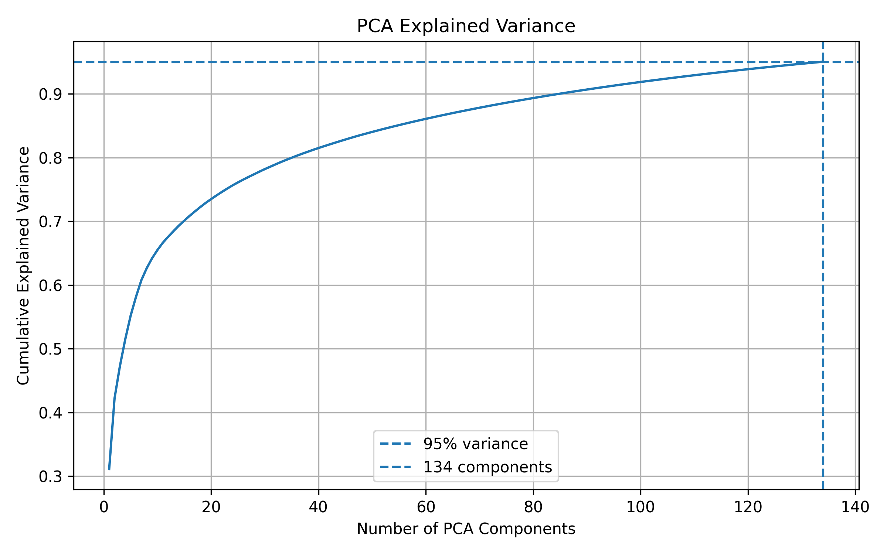
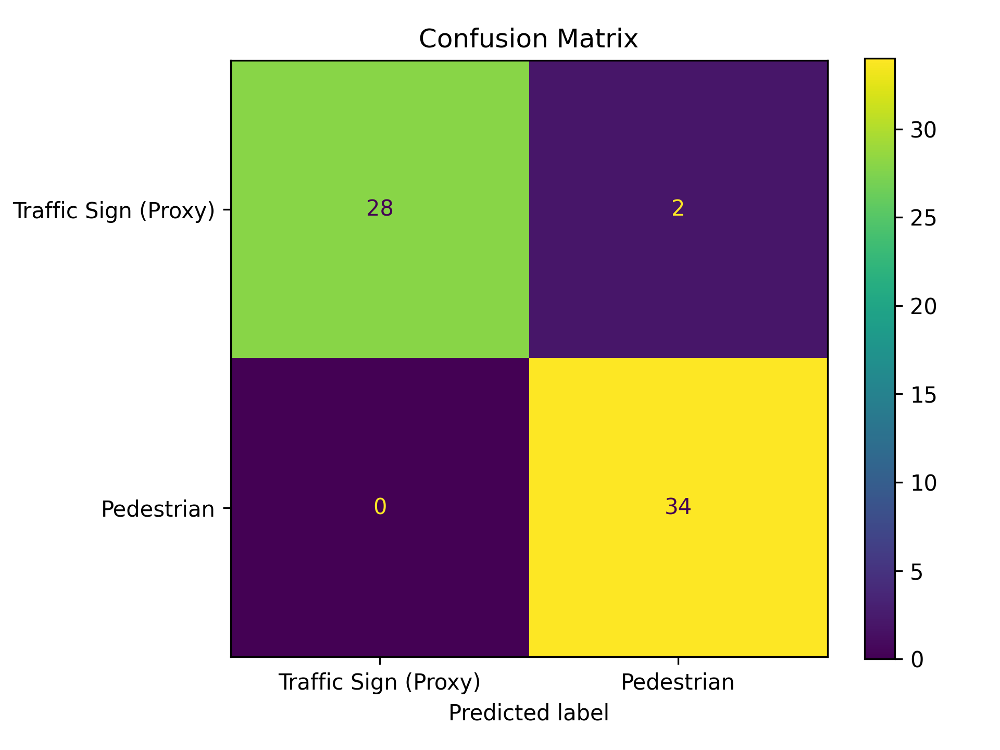
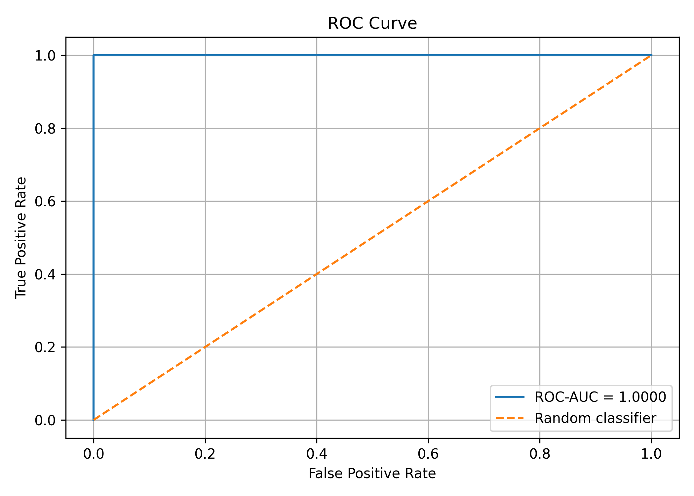
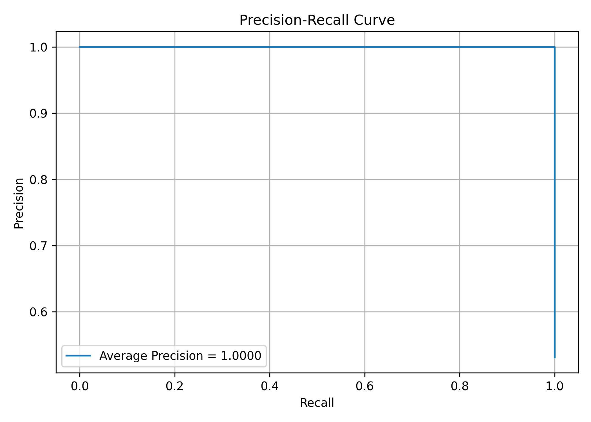

# PRML: Road Object Image Classification

A compact machine-learning pipeline for classifying road-scene images into two classes:

- **Pedestrian**
- **Traffic signal**

The project builds a balanced image dataset, preprocesses images into feature vectors, reduces dimensionality with PCA, trains an MLP classifier with stochastic gradient descent, and evaluates the resulting model using both a held-out test set and stratified 5-fold cross-validation.

## Pipeline overview

1. **Dataset construction** – Downloads the Road Objects Detection Dataset and selects images containing pedestrians or traffic signals.
2. **Preprocessing** – Converts the selected images into model-ready numerical features.
3. **Dimensionality reduction** – Fits PCA on the training data and retains at least 95% of the variance.
4. **Model training** – Tunes an `MLPClassifier` using SGD, learning rate, momentum, and stratified cross-validation.
5. **Evaluation** – Reports classification metrics and generates diagnostic plots.

## Repository structure

```text
.
├── requirements.txt
├── src/
│   ├── build_dataset.py
│   ├── preprocessing.py
│   ├── pca.py
│   ├── model.py
│   ├── cross_validation.py
│   ├── evaluation.py
│   └── predict_image.py
└── results/
    ├── evaluation_metrics.txt
    ├── cross_validation_results.txt
    ├── pca_explained_variance.png
    ├── confusion_matrix.png
    ├── roc_curve.png
    └── precision_recall_curve.png
```

## Results summary

### PCA

- Original feature dimensionality: **65,536**
- Selected components: **134**
- Cumulative explained variance: **95.06%**



### MLP with SGD

The final classifier uses an MLP with hidden layers `(64, 32)`, ReLU activations, early stopping, and SGD optimization.

- Learning rate: **0.01**
- Momentum: **0.95**
- Best cross-validation F1 during hyperparameter tuning: **0.9704**

### Held-out test set

The final evaluation used **64 test samples**.

| Metric | Score |
| --- | ---: |
| Accuracy | **96.88%** |
| Precision | **94.44%** |
| Recall | **100.00%** |
| F1 score | **97.14%** |
| ROC-AUC | **1.00** |
| Average precision | **1.00** |

#### Evaluation plots

| Confusion matrix | ROC curve |
| --- | --- |
|  |  |



### Stratified 5-fold cross-validation

| Metric | Mean ± standard deviation |
| --- | ---: |
| Accuracy | **95.31% ± 1.40%** |
| Precision | **95.40% ± 2.11%** |
| Recall | **95.88% ± 3.00%** |
| F1 score | **95.59% ± 1.34%** |

The cross-validation results indicate stable performance across folds, with an average F1 score of approximately **95.59%**.

## Installation

Create and activate a virtual environment, then install the dependencies:

```bash
python -m venv .venv
source .venv/bin/activate  # Windows: .venv\\Scripts\\activate
pip install -r requirements.txt
```

## Running the pipeline

Run the scripts from the repository root. The general workflow is:

```bash
python src/build_dataset.py
python src/preprocessing.py
python src/pca.py
python src/model.py
python src/cross_validation.py
python src/evaluation.py
```

To classify a new image after training, use:

```bash
python src/predict_image.py <path-to-image>
```

The exact command-line arguments accepted by the prediction script depend on its configuration; inspect `src/predict_image.py` if needed.

## Reproducibility

The pipeline uses fixed random seeds where applicable, including a random seed of `42` for dataset sampling, train/test splitting, PCA, and model training. Results can vary if the dataset, preprocessing configuration, or library versions change.

## Result files

The reported metrics are also preserved as text artifacts:

- [`evaluation_metrics.txt`](results/evaluation_metrics.txt)
- [`cross_validation_results.txt`](results/cross_validation_results.txt)

## License

No license has been specified for this repository yet.
